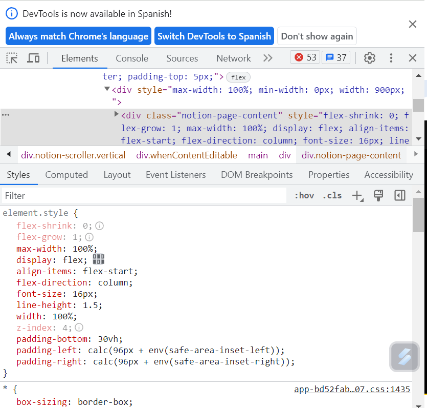

# Desarrollo Web

Date Created: 8 de julio de 2023 13:04
Status: Done 🙌

# Introducción a HTML y CSS

HTML Hiper Text Markup Language: Define la estructura en el contenido de la pagina web. Extensión .html

CSS: Cascading Style Sheets. Presentación de los elementos definidos en HTML. Extensión .css

JavaScript: Permite que la página diseñada en html y css sea interactiva

# Herramientas de Desarrollo de Chrome

Se puede ver la estructura de toda las páginas web al dar botón derecho y en INSPECT. Se abrirá una ventana con el código html

# Editores de Código

Visual Studio Code

Creamos una nueva carpeta de trabajo llamada Curso HTML y CSS

# Crear un archivo HTML

Vamos a crear el primer archivo, es un estandar que el archivo principal index.html

En la primera línea vamos a escribir que versión de html vamos a usar en nuestro archivo. DEBE SER LA PRIMERA LÍNEA QUE TENGAN TODOS LOS ARCHIVOS HTML

# Elementos y Etiquetas

Elemento: Componente básico de un archivo html. Usamos los elementos para definir la estructura de una pagina web en un archivo html

Etiquetas: Las etiquetas no permiten definir los elemntos en un archivo html. Especifivan el tipo de elemento que vamos a usar

Hay etiquetas que no requieren etiquetas de cierre como , es opcional colocar el cierre.

## Nuestro primer archivo

<html></html> se considera el elemento raíz, ya que dentro de este elemetno de la página van todos los demás elementos

Head y Body son los segundos elemnto de importancia. 

Dentro de Head son elemntos que actúan destrás de escena

Dentro de Body van los elemntos que van a dar la estructura de la página

# Especificar Idioma

# Crear Encabezados

Se crean dentro de body

# Párrafos

 es el elemtno para crear párrafos. Si el párrafo es muy largo, con ALT+Z este se acomoda al ancho de la ventana del edito de código

# Buscar en la Documentación

Buscar información de elementos en la documentación de desarrolladores de Mozilla. MDN WEB DOCS

# Comentarios en HTML

Nos sirven para ubicarnos y poner texto de referencia en las lineas de código. No afecta el contenido de la página. <!— COMENTARIO—>. Para volver una línea comentario, se puede usar el atajo CTRL+/ 

# Elemento main

El **elemento HTML `<main>`** representa el contenido principal del `[<body>](https://developer.mozilla.org/es/docs/Web/HTML/Element/body)` de un documento o aplicación. El área principal del contenido consiste en el contenido que está directamente relacionado, o se expande sobre el tema central de un documento o la funcionalidad central de una aplicación. Este contenido debe ser único al documento, excluyendo cualquier contenido que se repita a través de un conjunto de documentos como barras laterales, enlaces de navegación, información de derechos de autor, logos del sitio y formularios de búsqueda (a menos, claro, que la función principal del documento sea un formulario de búsqueda).

**Nota:** **no debe haber** más de un elemento `<main>` en un documento, y este **no debe ser** descendiente de un elemento `[<article>](https://developer.mozilla.org/es/docs/Web/HTML/Element/article)`, `[<aside>](https://developer.mozilla.org/es/docs/Web/HTML/Element/aside)`, `[<footer>](https://developer.mozilla.org/es/docs/Web/HTML/Element/footer)`, `[<header>](https://developer.mozilla.org/es/docs/Web/HTML/Element/header)`, o `[<nav>](https://developer.mozilla.org/es/docs/Web/HTML/Element/nav)`.

# Indentación

Se trata de jerarquizar los anidados de los códigos mediante espacios o tabulaciones. Se recomienda no mezclar espacios y tabulaciones

# Imágenes y Atributos

Se usa la etiqueta , no necesita etiqueta de cierre

en src se coloca la fuente de origen de la imagen, para este caso es una pagina web

atributo alt: da una descripción a la imagen por si hay una problema al cargar la página web

También se puede halar una imagen que este en una carpeta. Se recomienda usar una carpeta que se llame img y alojar las imagenes allí. En src se coloca la ubicación de la imagen

# Crear Enlaces Externos

Para crear enlaces externos de un texto, es decir qwue una frase o palabra sea un enlace a otra página usamos en elemento . Usamos tambien href en e el elemnto para inficar la url de la página de referencia

Si ingresamos al enlace, lo hace en la misma pestaña, por los que si se desea que el enlace sea en otra pestaña se agrega el atributo target=_blank

adicional por seguridad se coloca el atributo rel=”noopener noreferrer” nos permite evitar TABNABBING (es un término informático para definir un tipo de phishing (delito donde por medio de ingeniería social se obtiene datos de forma fraudulenta) descrito en 2010 por Aza Raskin[1](https://es.wikipedia.org/wiki/Tabnabbing#cite_note-1)[2](https://es.wikipedia.org/wiki/Tabnabbing#cite_note-2) y que se basa en persuadir al usuario de insertar datos para entrar en cuentas, normalmente de correos o redes sociales, por medio de páginas que aparentan ser las reales. Este método es muy peligroso porque se basa en la poca atención que un usuario puede tener mientras navega en múltiples pestañas y la falta de hábito de no revisar el [código fuente](https://es.wikipedia.org/wiki/C%C3%B3digo_fuente) al entrar en una página.)

# Enlaces a secciones internas

Para la creación de enlaces internos vamos a crear 4 enlaces con el nombre de los títulos de los párrafos. A cada párrafo, con su título, lo vamos a identificar de la siguiente manera. Y luego enlazamos los enlaces creados al nombre del párrafo

# Enlaces con imágenes

Para crear enlaces con imágenes, anidamos la imagen creada con  y lo ponemos en href el enlace destino con target blank y las medidas de seguridad

 

# Crear enlaces con #

Se usan como enlaces muertos. Son usados cuando aun no se tiene certeza a donde colocar el destino del href en el proceso de construcción de una pa´gina web

# Listas no ordenadas

Son Listas con Viñetas. Se hacen con los siguientes elementos

# Listas ordenadas

Listas numeradas

# Etiqueta strong

Texto en negrita

# Text en cursiva

# Texto Tachado

# Línea Horizontal

# Crear formularios

Se crea para que los usurios ingresen información.

/enviar-respuesta es el archivo destino a donde se enviará lo escrito por el usuario

# Texto Marcador de Posición

Para agregar texto de sugerencia de respuesta al usuario. Cuando el usuario empieza a escribir, el texto desaparece

# Crear un campo obligatorio

Se agrega “required”

# Botones de Radio

Son aquellos botones de selección múltiple. Van dentro del form y es de tipo radio. 

Label sirve para que al hacer click al texto tambien marque la opción, y bautizamos las respuestas como interior y exterior con un id de input

# Grupo de Botones de Radio

Para que se pueda escoger una sola respuesta en los botones de radio, se agrega el atributo name al input. Todo el conjunto de respuestas que se deseen que se escoja entre ellas, deben estar agrupados con el mismo nombre. Para esta caso, lo llamamos “interior-exterior”

# Salto de Línea

Para agregar un salto de línea entre los elemntos, se agraga el elemtno br

# Casillas de Verificación

# El atributo 'checked’

Nos marca las opciones que queremos que se marquen por defecto

# El atributo 'value’

Este es el valos que cada respuesta que el usuario ingrese el sistema va a tomar. Es decir, si se escoge EXTERIOR sin valo. No tendremos un valor ingresado, en cambio si le damos value=”exterior” el valor ingresado por el usuario sera exterior

# Elementos div

Es un contenedor para cualquier proposito.

 

# Pie de Página

Información de pie de página. Se pueden poner enlaces y se puede achical la letra con el elemento small

# Head

En el head se van a colocar todos los elementos que funcionan tras bambalinas en la pagina, mas especificamente CSS. También con title podemos ponerle título de la pestaña del navegador

# CSS

En HTML se define la estructura de la página, y con CSS se define el estilo

# 3 Opciones para CSS

Estilos de Línea: El estilo se añade directamente a la etiqueta de apertura en el HTML

Elemeto Style: Se añade el estilo en el head del HTML

Archivo CSS: Se crea un archivo css con el estilo de la pagina

# Estilos de Línea

Se va al archivo html, y se selecciona el elemento a dar estilo

# Elemento STYLE

Se añade el estilo a todos lo elemento de tipo h2 en este caso

# Archivo CSS

Se crea un archivo tipo .css con el nombre styel. Dentro de este, se establecen los estilos para el documento.

Y ya dentro del README, en el head se llama al archivo style con el elemento <link>, llamando al archivo style.css y dandole altributo rel (relationship) como stylesheet

# Selectores CSS

Los selectores definen sobre qué elemento se aplicará un conjunto de reglas CSS

# Selectores de Clase

Selecciona todos los elementos que tienen el atributo class especificado

Se define sobre el elemento, qué tipo de clase es

Luego, en el archivo style.css se definen las características de la clase. Siempre se debe iniciar con un punto. Así se puede asignar esa clase a cualquier elemento

# Tamaño de fuente

Para el cambio del tamaño de fuente, se usa en font-size y se define el tamaño de la letra, puede ser en pixeles

Si se desea aplicar un mismo tamaño de fuente a varios elementos, se puede colocar de la siguiente manera

Para agregar mas de una caracteristica de estylo, se puede hacer así. No olvidar el punto y coma al final

# Familias Tipográficas

Define una familia de fuentes. Si van separados por comas, es porque hay fuentes de respaldo. Caso de que si no funciona una, esta el siguiente como valor de respaldo

Se pueden agregar fuentes espaciales usando goolgle fonts. Se ingresa a la página y se escoge el tipo de fuente. Se  copia y se pega el texto en el head de el html

Luego en el CSS se pega el texto que muestra la página

Podemos descargar varias fuentes, colocarlas en el head y usarlas a los largo de la pagina según queramos

# Cambiar el tamaño de las imágenes

Podemos etsablecer el tamañano de todas las imágenes con el elemento with en css.

Para ajustar imágenes por separado, se recomienda hacerlo por clases

Se le coloca como atributo a la imagen la clase deseada. Y en el archivo style se definen las clases

# Añadir bordes alrededor de un elemento

Hay varias combinaciones de tipos de bordes 

# Esquinas redondeadas

se puede definir el radio de redondero o un porcentaje. Para imágenes cuadradas poner 50% hace que queden redondas y rectangulares ovoides

# Color de Fondo de un 

Podemos ponerle estilo a todos los div asi

o darle una clase al div y definir esa clase

# Atributo ID

Se le puede dar un id a un elemento y con este, en el archivo css darle características.

# Padding

Es la distancia entre el borde de un elmento html y su contenido. El Padding es el margen entre el espacio del div y lo que contiene

Padding 0px

Padding 20px

# Padding a cada lado

# Padding en una sola línea

Se puede establecer un padding en una línea especificando su grosor empezando por arriba y en sentido horario

# Margen

# Ajustar el Margen

Margen en una sola linea

# Margen en una sola línea

# Padding vs. Margin

# Selectores de Atributos

En esta sección podemos definir un elemento que tenga un valor determinado y darle un atributo, Por ejemplo, todas la imágenes que tengan alt les vamos a dar radio del 50%

Para seleccionar los elemntos input con valor radio

Para los elemntos de verificacion

Para elementos que lleven a un mismo enlace, le cambiamos el color de la letra, quitamos el subtitulado y le pusimos negrilla

# Unidades Absolutas y Relativas

Todas las unidades siguientes son unidades de longitud **absoluta**: no son relativas a nada más y en general se considera que siempre tienen el mismo tamaño.

La mayoría de estos valores son más útiles cuando se usan en una salida en formato impreso que en la salida de pantalla. Por ejemplo, normalmente no usamos `cm` (centímetros) en pantalla. El único valor que usarás de forma frecuente es `px` (píxeles).

### Unidades de longitud relativa

Las unidades de longitud relativa son relativas a algo más, por ejemplo, al tamaño de letra del elemento principal o al tamaño de la ventana gráfica. La ventaja de usar unidades relativas es que con una planificación cuidadosa puedes lograr que el tamaño del texto u otros elementos escalen en relación con todo lo demás en la página. En la tabla siguiente se enumeran algunas de las unidades más útiles para el desarrollo web.

Ejemplo

# Aplicar estilo a <body>

Al elemento body se le peude dar un estilo mediante la aplicación de atributos. Estos atributos se aplicarán a todo el body

# Prioriza un estilo sobre otro

El orden de las clases en el archivo html no define cual es prioridad. Es la última clase que aparece en el archivo css

# Prioridad de class vs id

Id se prioriza sobre las clases, y las clases sobre lo selectores de tipo

# Prioridades de los estilos en línea

El estilo en línea se prioriza sobre el id. Si se desea que un atributo sea prioridad sobre los demás, se debe colocar !important y así se prioriza

# Códigos Hexadecimales para Colores

Código en base 16. Es decir que cada dígito puede tener 16 valores diferentes, entre 0 y 1 y A y F

# Abreviar Códigos Hexadecimales

ff00ff=f0f

000000=000

00ff00=0f0

# Valores RGB para Colores

Cada color tiene una equivalencia en los diferentes sistemas de representación

En google se usa COLOUR PICKER y se puede buscar un color y conocer sus diferentes representaciones

Parandonos sobre el color, se puede acceder en VSC a una herramienta similar a Colour Picker. Allí se puede personalizar un color a gusto, y aparece un cuarto numero (entre 0 y 1) que indica la transparencia del color

# Variables en CSS

Una variable es un nombre que se le da a un valor, para poder usarlo más adelante únicamente con el nombre. Se denota con dos guiones previos al nombre de la variable

# Compatibilidad de variables

Se recomienda usar valores de respaldo en las variables

y si se desea tener un respaldo, pues hay navegadores que no son compatibles con las variables CSS se recomienda dar un respaldo de la siguiente manera

# Herencia de variables CSS

Cuando se asignan variables, estas quedan asignadas a las clases. Si se desea que se aplique a todo el archivo html, se hace de la siguiente manera

# Cambiar Variable para un Área Específica

Se define la variable en root, y luego, en las clases que se desea cambiar se define nuevamente

